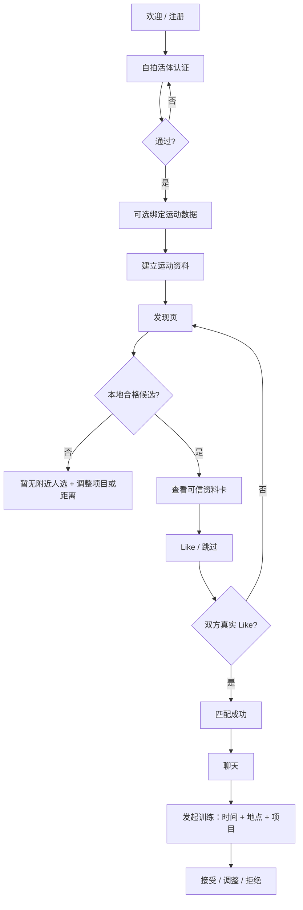
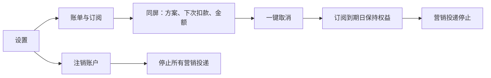

# PACE — 运动交友 MVP 产品规格 v0.2

**产品决策同步：2026-09-08**

**2026-10-04 交接说明：** 本文保留早期产品规则。后续明确选择及当前实现边界见 [PROJECT_HANDOFF.txt](./PROJECT_HANDOFF.txt)：视觉已改为炭黑纹理与 `#B4CF42`，运动摘要最终采用横向等分排列。本文旧配色、纵排和早期入口描述不再作为当前视觉依据；简介长度、项目数量、认证门槛等与代码的差异已列为待归一事项，不能把代码默认值视为新产品决定。

## 1. 产品原则（不可降级）

PACE 让相识从共同的活跃生活方式开始。界面以真人照片建立第一印象，再用认证、共同项目、频率和时间偏好解释「为什么适合」；既不做纯健身竞技产品，也不把每次连接预设为恋爱。

### 产品定位与文案语气

PACE 面向把运动视为生活方式的人，帮助他们认识活动搭子、潜在伴侣，或可能同时成为两者的人。运动是判断生活方式是否契合的共同语境，不是竞技门槛，也不是每个页面都要重复的口号。

- 主叙事优先使用「认识、匹配、连接、共同兴趣、一起安排」等关系语言。
- 运动项目、时间习惯和活跃频率用于解释“为什么适合”，不把速度、成绩或训练强度包装成用户价值。
- 避免健身房式竞技口号，也避免过度暧昧、催促约会或把所有连接预设为恋爱。
- 页面标题保持直接、适中；功能名称优先使用用户熟悉的词，例如 `Matches`、`Profile`、`Settings & account`。

| 红线 | MVP 落地规则 |
| --- | --- |
| 距离可用 | 发现页顶部常驻筛选入口，距离在一次点击内可调；无锁、不可因订阅隐藏。 |
| 无订阅降级 | 权益为只增不减；订阅状态不修改已可见信息或基础筛选。 |
| 无假互动 | 只渲染服务端真实 Like/Match 记录；禁止付费诱导式假弹窗。 |
| 取消一键可达 | 设置一级菜单直接进入账单；账单同屏显示取消按钮，无二次挽留墙。 |
| 停止营销 | `cancelled_at` 或 `deleted_at` 后，营销消息投递器必须拒发。 |
| 稀薄地区诚实 | 本地合格候选不足时展示轻量空状态并建议调整项目或距离；绝不以远距离候选填充，也不展示没有真实后端支持的等待名单按钮。 |
| 真人与运动认证 | 自拍活体认证必经；绑定 Strava / Apple Health / Garmin 为可选的可信运动数据来源。 |

## 2. 信息架构

### 全局导航（登录后）

1. **发现 Discover**：单行项目筛选、偏好入口、照片优先资料卡、Like / 跳过 / 活动意向。
2. **匹配 Connect**：匹配列表与喜欢我的人（后者可订阅解锁）；点击完整匹配行直接进入聊天。
3. **动态 Community**：仅展示已连接用户的活动、点赞和评论。
4. **训练 Train**：公开活动与组织入口；一对一聊天和结构化邀约从匹配或动态进入。
5. **我 Me**：`My profile` 与 `Settings & account` 同页分区切换，承载资料、隐私、账单和注销。

### 页面清单与职责

| 区域 | 页面/状态 | 关键内容与动作 |
| --- | --- | --- |
| Onboarding | 欢迎与价值主张 | 选择手机号或邮箱；明确「从训练开始」。 |
| Onboarding | 注册 | 手机号/邮箱、年龄、同意条款；不默认勾选营销。 |
| Trust | 自拍活体认证 | 动作引导、进度、通过/重试。 |
| Trust | 连接运动数据 | Strava / Apple Health / Garmin；允许跳过并稍后绑定。 |
| Profile | 建立资料 | 运动项目多选、频率、水平、无最短字数的简介、最多 6 张照片。 |
| Discover | 发现主页 | 一行完整展示常用项目与偏好入口、照片画廊、认证徽章、运动摘要和剩余 Like。 |
| Discover | 稀薄地区空状态 | 用简短友好的文案说明当前组合暂无附近人选，并建议调整项目或距离；不显示超半径候选或无效 CTA。 |
| Connect | 匹配 | 实时匹配清单与真实点赞者；付费只用于查看完整点赞者。 |
| Train | 对话 | 自由文字 + 默认主操作「发起训练」。 |
| Train | 训练邀约底表 | 项目、日期时间、地点、备注、发送/接受/调整。 |
| Train | 公开活动 | 认证组织者创建活动（付费组织工具）；报名和参加者资料。 |
| Me | 我的资料 | 真人照片、认证状态、运动摘要与独立全屏编辑资料页面。 |
| Settings | 设置 | 作为 Me 内的并列分区，一级入口包含语言、隐私、账单与订阅、注销账户。 |
| Settings | 账单与订阅 | 当前方案、下次扣款日期与金额、同屏「取消订阅」。 |
| Settings | 注销账户 | 明确删除后停止营销；确认后不可接收营销投递。 |

## 3. 核心流程图

## 4. 逐页 UI 设计方案

### 设计语言

- **调性**：深夜跑道蓝黑为底，荧光薄荷绿作行动色，珊瑚橙只用于能量/提醒；避免红黄的 Tinder 叠卡语言。
- **排版**：清晰无衬线、适中的页面标题；运动数据仅在需要解释兼容性时强调，内容先于装饰。
- **可信层级**：照片负责第一印象，头像裁切必须优先露出人脸；认证、共同项目、频率和简介紧随其后，避免只凭外貌或只凭成绩判断。
- **动效**：训练邀约和匹配卡采用短促、方向明确的位移；为减少动效用户提供系统级减少动态支持。

### Onboarding / 注册

深色全屏、真实训练场景作低对比背景。主文案为“把下一次约会，放进训练计划”。手机号 / 邮箱为并列入口；营销同意为关闭态独立开关。

### 自拍活体认证

浅色高对比相机面板，单一行动“开始认证”。采用三步环形进度和明确的隐私说明（只用于防冒充）；失败提供重试，永不以付费替代。

### 运动数据绑定

三个数据源为平等可点选卡。说明会同步项目与训练频率，不同步精确路线；「稍后再说」保持可见。

### 建立/编辑资料

运动项目是可多选的标签网格，不限制数量。频率和水平为分段选择。简介默认空白，无“至少 N 字”校验。照片计数 `0/6`，认证状态常驻于顶部。

### 发现页

顶部使用一条不横向滚动的项目筛选栏，并把距离等偏好收进同排入口。资料卡采用可浏览的全幅真人照片，人物脸部和主体必须在不同屏幕宽度下可见；卡片下方用协调的纵向项目列表和每周活动次数解释生活方式。底部操作为跳过、Like、活动意向，不使用虚假计数或付费诱导。

### 稀薄地区空状态

不出现远距离用户，不出现伪卡片，也不展示没有真实服务支持的「加入等待名单」。使用轻量、有一点个性的空状态，引导用户切换项目或放宽距离，但系统不会自行越过用户半径。

### 匹配 / 聊天

匹配成功只在双方真实 Like 后出现。聊天顶部显示双方验证标签；输入框上方的主按钮为“发起一场训练”，打开结构化训练邀约；自由文本始终可用。

### 训练邀约

已匹配用户继续从聊天中发起免费训练邀约。发现页向未匹配用户发起邀约属于 PACE Plus 权益；提交时服务端重新检查会员有效期、真实匹配关系、双向拉黑和待回应的重复邀约。此类邀约保存为 pending，不自动创建匹配或会话。表单按运动、未来时间、公共集合地点、可选附言组织。

### 公开活动

认证用户可见“创建公开活动”入口；该组织工具是付费权益。非订阅者看到透明的权益说明，而不是把距离或匹配能力锁住。活动卡显示项目、强度、人数、时间地点和组织者认证。

### 账单与订阅

Plus 页面清晰展示查看喜欢、匹配前邀约、认证后创建公开活动三项权益；匹配、与已匹配用户聊天、报名活动保持免费。方案名称、价格与周期读取 StoreKit 本地化产品信息，禁止在产品界面硬编码待定售价。

账户会员页读取服务端状态、续期或权益截止日期，提供恢复购买和 Apple 原生订阅管理入口；关闭系统管理页不代表取消成功。取消续期后保留已付费期间权益，到期或撤销后拒绝新的会员操作。生产后端收到已验证取消状态后同步营销资格。没有原生购买桥或产品配置时显示暂不可购买，不模拟付款成功。

### 设置 / 删除账户

“账单与订阅”是设置首屏菜单。删除账户页用简洁的不可逆说明和确认按钮，确认文字明确包括“不再发送任何营销通知或邮件”。

## 5. MVP 数据与权限边界

- `Verification`：`selfie_liveness_status`, `verified_at`，仅用于真实性展示和信任决策。
- `FitnessConnection`：`provider`, `scopes`, `last_synced_at`, `weekly_sessions`；默认只展示摘要，不暴露轨迹。
- `DiscoveryPreference`：`max_distance_km` 是基础字段；不得因计划变化而变窄或隐藏。
- `Subscription`：`tier`, `status`, `expiresAt`, `autoRenews`, `source`；权益由服务端验证后的订阅状态派生，取消续费保留已付款有效期，退款/撤销及时重算。
- `CommunicationConsent`：营销投递必须检查 `cancelled_at is null AND deleted_at is null AND marketing_opt_in is true`。

## 6. 验收测试矩阵

| 编号 | 用户故事 | 期望结果 |
| --- | --- | --- |
| UT-01 | 用户进入发现页 | 始终能在顶部一次点击内进入距离偏好，不出现订阅锁；常用项目在一行内完整展示。 |
| UT-02 | 订阅后再取消 | 距离筛选保持可用；已获得权限保持至到期日。 |
| UT-03 | 当前筛选无本地候选 | 显示诚实空状态和调整建议，不呈现超出半径的候选或无效等待名单按钮。 |
| UT-04 | 用户查看资料卡 | 自拍认证和运动数据源比年龄/简介更醒目。 |
| UT-05 | 双方真实 Like | 仅在双方 Like 存在时创建匹配。 |
| UT-06 | 匹配后破冰 | 可一键打开训练邀约，且仍可自由发文字。 |
| UT-07 | 用户管理订阅 | 设置一级可到达账单；账单同屏可取消。 |
| UT-08 | 取消或注销后 | 营销投递被系统拒绝。 |
| UT-09 | 用户添加简介 | 空简介与简短简介均可保存。 |
