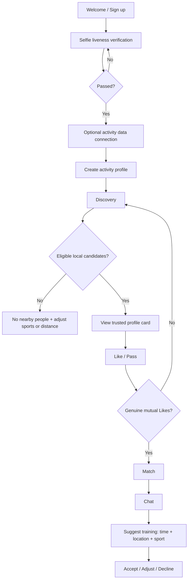
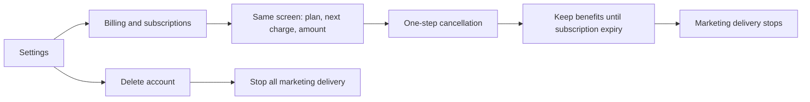

# PACE — Sport Dating MVP Product Specification v0.2

**Product decisions synchronized: 2026-09-08**

**2026-10-04 handoff note:** This document preserves the earlier product rules. See [PROJECT_HANDOFF.txt](./PROJECT_HANDOFF.txt) for later confirmed choices and current implementation boundaries: the visual direction now uses a charcoal texture and `#B4CF42`, and the sports summary uses equal-width columns in one horizontal row. The older palette, vertical arrangement, and early entry-point descriptions below no longer define the current visual design. Differences between this specification and the code, including bio length, sport count, and verification requirements, are recorded as items to reconcile. Code defaults do not constitute new product decisions.

## 1. Product principles (non-negotiable)

PACE helps people meet through a shared active lifestyle. Real photos establish a first impression; verification, shared sports, frequency, and availability explain why two people might connect. The product is neither focused solely on competitive fitness nor built on the assumption that every connection must be romantic.

### Positioning and voice

PACE is for people who treat movement as part of their lifestyle. It helps them meet an activity partner, a potential romantic partner, or someone who could become both. Sport provides context for lifestyle compatibility, not a competitive entry requirement or a slogan to repeat on every screen.

- Lead with relationship language: meeting people, matching, connecting, shared interests, and making plans together.
- Use sports, routines, and activity frequency to explain compatibility. Do not present speed, performance, or training intensity as a person's value.
- Avoid competitive gym slogans, excessive flirtation, pressure to date, or the assumption that all connections are romantic.
- Keep page titles direct and proportionate. Prefer familiar feature names such as `Matches`, `Profile`, and `Settings & account`.

| Non-negotiable principle | MVP rule |
| --- | --- |
| Accessible distance filtering | Keep a filter entry at the top of Discovery, with distance adjustable within one tap. Never lock or hide it behind a subscription. |
| No reduction in basic access | Subscription benefits are additive. Subscription status must not change information already visible or basic filters. |
| No fabricated interactions | Render only genuine server-side Like/Match records. Never fabricate pop-ups to encourage payment. |
| Direct cancellation access | Open billing directly from the first level of Settings. Show cancellation on the billing screen without an additional retention barrier. |
| Stop marketing | The marketing delivery service must reject messages after `cancelled_at` or `deleted_at` is set. |
| Honest low-density results | When there are too few eligible local candidates, show a lightweight empty state and suggest adjusting sports or distance. Never fill results with distant candidates or show a waitlist button without real backend support. |
| Identity and activity verification | Selfie liveness verification is required. Linking Strava / Apple Health / Garmin is optional and can provide trusted activity data. |

## 2. Information architecture

### Global navigation (signed in)

1. **Discover**: one-row sport filters, preferences entry, photo-first profile card, Like / Pass / activity interest.
2. **Connect**: matches and people who liked you, with the latter unlocked by subscription. Tapping the complete match row opens chat directly.
3. **Community**: activities, likes, and comments from connected users only.
4. **Train**: public activities and hosting entry. One-to-one chat and structured invitations are reached from matches or the feed.
5. **Me**: switch between `My profile` and `Settings & account` within the same page for profile, privacy, billing, and account deletion.

### Screens and responsibilities

| Area | Screen/state | Key content and actions |
| --- | --- | --- |
| Onboarding | Welcome and value proposition | Choose phone or email; communicate that connection starts with training. |
| Onboarding | Sign up | Phone/email, age, and terms consent; marketing consent is not preselected. |
| Trust | Selfie liveness verification | Guided actions, progress, and pass/retry states. |
| Trust | Connect activity data | Strava / Apple Health / Garmin; allow skipping and connecting later. |
| Profile | Create profile | Multiple sports, frequency, level, a bio without a minimum length, and up to 6 photos. |
| Discover | Main Discovery screen | Common sports and preferences fit in one row; photo gallery, verification badge, sports summary, and remaining Likes. |
| Discover | Low-density empty state | Brief, friendly copy explains that no nearby people match the current filters and suggests changing sports or distance. No out-of-radius candidates or ineffective CTA. |
| Connect | Matches | Live matches and genuine likers; payment only unlocks full liker profiles. |
| Train | Conversation | Free text plus a default primary action to suggest a training session. |
| Train | Training invitation sheet | Sport, date/time, location, notes, and send/accept/adjust actions. |
| Train | Public activities | Verified hosts create activities using paid hosting tools; registration and participant profiles. |
| Me | My profile | Real photos, verification status, sports summary, and a separate full-screen profile editor. |
| Settings | Settings | A sibling section within Me, with first-level entries for language, privacy, billing and subscriptions, and account deletion. |
| Settings | Billing and subscriptions | Current plan, next charge date and amount, and cancellation on the same screen. |
| Settings | Delete account | State clearly that deletion stops marketing; no marketing delivery after confirmation. |

## 3. Core flows

## 4. Screen-by-screen UI design

### Design language

- **Tone**: a midnight running-track blue-black base, fluorescent mint green for actions, and coral orange only for energy or alerts. Avoid Tinder-like red/yellow card-stack styling.
- **Typography**: clear sans-serif type and proportionate page titles. Emphasize activity data only when it explains compatibility; content comes before decoration.
- **Trust hierarchy**: photos establish the first impression, and avatar crops must prioritize faces. Verification, shared sports, frequency, and bio follow closely, avoiding judgments based solely on appearance or performance.
- **Motion**: use brief, directional transitions for training invitations and match cards. Respect the system's reduced-motion preference.

### Onboarding / Sign up

A dark full-screen layout with a low-contrast real training scene as the background. The main line is “Make your next date part of your training plan.” Phone and email are parallel entry points; marketing consent is a separate switch that starts off.

### Selfie liveness verification

A light, high-contrast camera panel with one action: “Start verification.” Use a three-step circular progress indicator and a clear privacy explanation that this is only for preventing impersonation. Offer retry on failure; payment never substitutes for verification.

### Activity data connection

Present the three sources as equally selectable cards. Explain that sports and training frequency are synchronized, while precise routes are not. Keep “Maybe later” visible.

### Create/edit profile

Sports use a multi-select chip grid without a count limit. Frequency and level use segmented choices. The bio starts empty and has no minimum-character validation. Show the photo count as `0/6` and keep verification status at the top.

### Discovery

Use one non-scrolling row of sport filters at the top, with distance and other preferences in an entry on the same row. Profile cards display browsable, full-width photos of real people; the face and subject must remain visible across screen widths. Below the photo, a coordinated vertical sport list and weekly activity count explain lifestyle. Bottom actions are Pass, Like, and activity interest, with no fabricated counts or payment pressure.

### Low-density empty state

Show no distant users, fabricated cards, or “Join the waitlist” action without a real supporting service. Use a lightweight empty state with a little personality to encourage changing sports or widening the distance. The system must never expand the user's radius by itself.

### Matches / Chat

A match appears only after genuine mutual Likes. Show both users' verification labels at the top of chat. The primary button above the composer is “Suggest a training session,” which opens a structured invitation. Free text remains available at all times.

### Training invitations

Matched users continue to send free training invitations from chat. Sending an invitation from Discovery to someone who is not matched is a PACE Plus benefit. At submission, the server rechecks membership validity, the actual match relationship, blocking in either direction, and duplicate pending invitations. These invitations are saved as pending and do not automatically create a match or conversation. Organize the form around sport, a future date/time, a public meeting place, and an optional note.

### Public activities

Verified users see “Create public activity”; this hosting tool is a paid benefit. Non-subscribers see a clear explanation of the benefit, without restricting distance filtering or matching. Activity cards show sport, intensity, attendance, date/time, location, and host verification.

### Billing and subscriptions

The Plus screen clearly presents three benefits: seeing who liked you, sending invitations before matching, and creating public activities after verification. Matching, chatting with matches, and joining activities remain free. Read plan names, prices, and billing periods from localized StoreKit product information. Never hard-code an undecided price in the product UI.

The account membership screen reads server-side status and the renewal or entitlement end date. It offers Restore purchases and Apple's native subscription management entry. Closing the system management screen does not confirm cancellation. Keep paid benefits after renewal is cancelled, then reject new member-only actions after expiry or revocation. The production backend updates marketing eligibility after receiving verified cancellation status. If the native purchase bridge or product configuration is unavailable, show that purchasing is unavailable; do not simulate payment success.

### Settings / Delete account

“Billing and subscriptions” appears on the first Settings screen. Account deletion uses a concise explanation of the irreversible action and a confirmation button. Confirmation text explicitly states that no further marketing notifications or emails will be sent.

## 5. MVP data and authorization boundaries

- `Verification`: `selfie_liveness_status`, `verified_at`; used only to display authenticity and inform trust decisions.
- `FitnessConnection`: `provider`, `scopes`, `last_synced_at`, `weekly_sessions`; show summaries by default without exposing routes.
- `DiscoveryPreference`: `max_distance_km` is a basic field and must not be narrowed or hidden because of a plan change.
- `Subscription`: `tier`, `status`, `expiresAt`, `autoRenews`, `source`; derive benefits from server-verified subscription status, preserve the paid period after renewal cancellation, and promptly recalculate after refunds/revocation.
- `CommunicationConsent`: marketing delivery must check `cancelled_at is null AND deleted_at is null AND marketing_opt_in is true`.

## 6. Acceptance test matrix

| ID | User story | Expected result |
| --- | --- | --- |
| UT-01 | A user opens Discovery | Distance preferences are always reachable from the top within one tap, without a subscription lock; common sports fit in one row. |
| UT-02 | A user subscribes and then cancels | Distance filtering stays available; acquired benefits remain until expiry. |
| UT-03 | No local candidates match the current filters | Show an honest empty state and adjustment suggestions, with no out-of-radius candidates or ineffective waitlist button. |
| UT-04 | A user views a profile card | Selfie verification and activity data sources are more prominent than age/bio. |
| UT-05 | Two users genuinely Like each other | Create a match only when both Likes exist. |
| UT-06 | Users break the ice after matching | A training invitation opens in one tap, while free-text messaging remains available. |
| UT-07 | A user manages their subscription | Billing is reachable from the first level of Settings, with cancellation on the billing screen. |
| UT-08 | A user cancels a subscription or deletes their account | The system rejects marketing delivery. |
| UT-09 | A user adds a bio | Both empty and short bios can be saved. |
